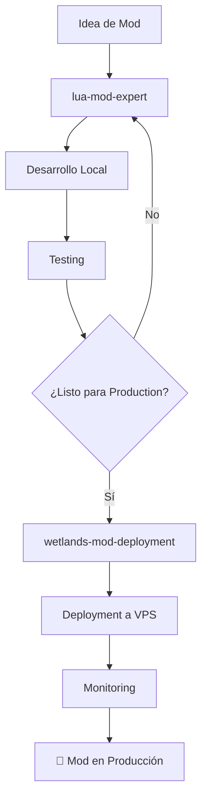

# 🤖 Agentes Especializados de Claude para Wetlands

Este directorio contiene agentes especializados de Claude diseñados para ayudar con diferentes aspectos del desarrollo y mantenimiento del servidor Wetlands.

## 📋 Agentes Disponibles

### 🛠️ `lua-mod-expert.md`
**Especialista en Desarrollo de Mods**

**Úsalo cuando:**
- 💻 Quieras desarrollar un nuevo mod para Wetlands
- 🐛 Necesites ayuda con debugging de código Lua
- 🔧 Tengas problemas de compatibilidad con VoxeLibre
- 📚 Busques ejemplos de código y mejores prácticas
- 🧪 Quieras implementar testing para tus mods
- ❓ Tengas preguntas sobre APIs de VoxeLibre

**Especialidades:**
- Arquitectura de mods profesional
- Compatibilidad VoxeLibre específica
- Mods educativos y compasivos
- Testing y validación integrada
- Optimización de performance
- Debugging avanzado

### 🚀 `wetlands-mod-deployment.md`
**Especialista en Deployment y Operaciones**

**Úsalo cuando:**
- 📦 Quieras deployar un mod a producción
- 🔄 Necesites configurar CI/CD automatizado
- 💾 Requieras backup y recuperación
- 📊 Necesites monitoring y troubleshooting
- ⚙️ Tengas problemas de infraestructura
- 🚨 Enfrentes emergencias del servidor

**Especialidades:**
- Deployment automatizado y seguro
- Gestión de backups y recuperación
- Monitoring proactivo y alertas
- Troubleshooting de producción
- Configuración Docker y VPS
- Scripts de automatización

## 🎯 Flujo de Trabajo Recomendado



## 📖 Guías Rápidas

### 🆕 Para Desarrollar un Nuevo Mod

1. **Consultar `lua-mod-expert`**:
   ```
   "Quiero crear un mod educativo sobre reciclaje para Wetlands"
   ```

2. **Seguir las recomendaciones** del agente para:
   - Estructura del mod
   - Compatibilidad VoxeLibre
   - Implementación de mecánicas educativas
   - Testing integrado

3. **Una vez completado**, consultar `wetlands-mod-deployment`:
   ```
   "Mi mod está listo. ¿Cómo lo despliego a producción?"
   ```

### 🔧 Para Problemas Técnicos

**Problemas de Desarrollo** → `lua-mod-expert`:
- "Mi mod no carga, ¿qué API de VoxeLibre debo usar?"
- "¿Cómo implemento un animal pacífico educativo?"
- "Tengo errores de sintaxis Lua, ¿me ayudas?"

**Problemas de Producción** → `wetlands-mod-deployment`:
- "El servidor está caído después del último deployment"
- "Necesito hacer rollback de un mod problemático"
- "¿Cómo configuro alertas automáticas?"

### 🚨 Para Emergencias

1. **Problema Crítico** → `wetlands-mod-deployment` PRIMERO:
   ```
   "URGENTE: El servidor no responde, necesito diagnóstico y recovery"
   ```

2. **Una vez estabilizado**, usar `lua-mod-expert` para:
   ```
   "El problema fue causado por mi mod X, ¿cómo lo arreglo?"
   ```

## 🔗 Recursos Adicionales

### 📚 Documentación de Referencia
- **`docs/mods/GUIA_COMPLETA_DESARROLLO_MODS.md`** - Guía unificada completa
- **`CLAUDE.md`** - Configuración y arquitectura de Wetlands
- **`docs/VOXELIBRE_MOD_SYSTEM.md`** - Sistema específico de VoxeLibre

### 🛠️ Scripts Útiles
- **`scripts/create-wetlands-mod.sh`** - Template rápido para nuevos mods
- **`scripts/deploy-mod-complete.sh`** - Deployment automatizado
- **`scripts/diagnose-wetlands.sh`** - Diagnóstico completo

## 💡 Tips para Usar los Agentes

### ✅ Mejores Prácticas
- **Sé específico** en tus consultas: incluye código, errores exactos, contexto
- **Menciona tu nivel** de experiencia con Lua/Minetest/VoxeLibre
- **Incluye el objetivo educativo** si estás desarrollando contenido
- **Proporciona logs completos** cuando tengas problemas

### 📝 Ejemplos de Consultas Efectivas

**Buenas** ✅:
```
"Estoy desarrollando un mod educativo sobre nutrición para niños de 7+ años.
Quiero crear bloques interactivos que enseñen sobre grupos alimenticios.
Necesito ayuda con la estructura básica y compatibilidad VoxeLibre."
```

```
"Mi deployment falló y veo este error en los logs: [PEGAR LOG].
El servidor estaba funcionando antes de deployar el mod 'animal_care_v2'.
¿Cómo puedo hacer rollback rápido?"
```

**Menos efectivas** ❌:
```
"¿Cómo hago un mod?"
```

```
"No funciona, ayuda"
```

## 🎯 Objetivos de los Agentes

### 🌱 Propósito Compartido
Ambos agentes están diseñados para:
- **Promover educación compasiva** a través del desarrollo técnico
- **Mantener alta calidad** en código y operaciones
- **Asegurar experiencia positiva** para niños 7+ años
- **Facilitar colaboración** en la comunidad Wetlands

### 🤝 Complementariedad
- **`lua-mod-expert`**: "Cómo construir"
- **`wetlands-mod-deployment`**: "Cómo entregar"

---

**🌟 Recuerda**: Estos agentes están aquí para ayudarte a crear experiencias educativas increíbles que inspiren compasión y aprendizaje en los niños. ¡No dudes en consultarlos para cualquier aspecto del desarrollo en Wetlands!