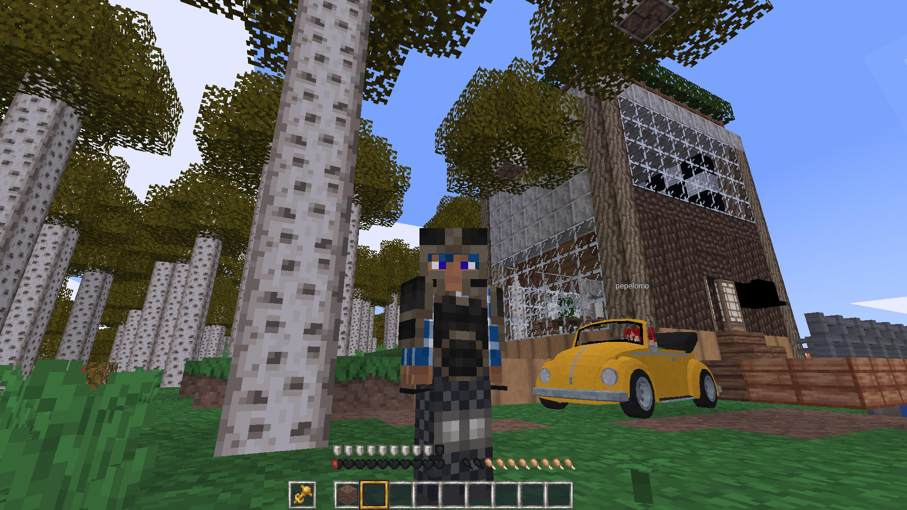

# 🚀 FUTURE IMPROVEMENTS - Landing Page Wetlands

Documento de propuestas de mejora para la arquitectura y funcionalidades futuras de la landing page de Wetlands.

**Estado Actual**: ✅ Landing page funcional con sistema de galería centralizado JSON
**Última Actualización**: Nov 2025
**Prioridad**: Media-Baja (sistema actual funciona bien)

---

## 📋 Tabla de Contenidos

1. [Mejoras de Infraestructura](#-mejoras-de-infraestructura)
2. [Optimización de Imágenes](#-optimización-de-imágenes)
3. [Funcionalidades Nuevas](#-funcionalidades-nuevas)
4. [Performance y SEO](#-performance-y-seo)
5. [Experiencia de Usuario](#-experiencia-de-usuario)
6. [Integración con Servicios](#-integración-con-servicios)

---

## 🏗️ Mejoras de Infraestructura

### 1. Migración a Cloudflare R2 Storage

**Problema Actual**: Las imágenes se almacenan en el VPS (<VPS_IP>), consumiendo espacio de disco y ancho de banda del servidor de juegos.

**Propuesta**: Migrar imágenes a **Cloudflare R2** (S3-compatible storage)

**Ventajas**:
- ✅ **Sin costos de egreso**: Cloudflare R2 no cobra por transferencia de datos
- ✅ **Espacio ilimitado prácticamente**: 10GB gratis, luego $0.015/GB/mes
- ✅ **CDN global**: Imágenes servidas desde edge locations cercanas al usuario
- ✅ **Descongestionar VPS**: Liberar espacio para el servidor de juegos Luanti
- ✅ **Mejor performance**: Menor latencia de carga de imágenes
- ✅ **Backups automáticos**: R2 tiene redundancia multi-datacenter

**Desventajas**:
- ❌ Requiere cuenta Cloudflare (ya tenemos dominio, fácil activar)
- ❌ Cambio en arquitectura de deployment
- ❌ URLs externas (no self-hosted)

**Arquitectura Propuesta**:
```
Arquitectura Actual:
gallery-data.json → VPS (/var/www/luanti-landing/assets/images/)
                     ↓
                  Nginx sirve imágenes locales

Arquitectura con R2:
gallery-data.json → Cloudflare R2 Bucket (r2.luanti.gabrielpantoja.cl)
                     ↓
                  CDN global (cache en edge)
```

**Implementación**:
```json
// gallery-data.json (ejemplo con R2)
{
  "images": [
    {
      "id": "vehicles-2025-11",
      "filename": "AUTO-AMARILLO.png",
      "url": "https://r2.luanti.gabrielpantoja.cl/gallery/AUTO-AMARILLO.png",
      "cdn_url": "https://cdn.luanti.gabrielpantoja.cl/gallery/AUTO-AMARILLO.png",
      "thumbnail_url": "https://cdn.luanti.gabrielpantoja.cl/gallery/thumbs/AUTO-AMARILLO-thumb.webp"
    }
  ]
}
```

**Estimación de Costos**:
- Cloudflare R2: **GRATIS** hasta 10GB storage + 1M requests/mes
- Imágenes actuales: ~10MB → Bien dentro del free tier
- Crecimiento estimado: 50 imágenes/año × 200KB = 10MB/año → Gratis por años

**Prioridad**: 🟡 Media (optimización, no crítico)

---

### 2. URLs Dedicadas por Imagen

**Problema Actual**: Las imágenes se acceden solo desde la galería modal, no tienen URL individual compartible.

**Propuesta**: Sistema de URLs SEO-friendly para cada imagen

**Ventajas**:
- ✅ **Compartir en redes sociales**: Cada imagen tiene link único
- ✅ **SEO mejorado**: Indexación individual de imágenes
- ✅ **Deep linking**: Abrir galería directamente en una imagen específica
- ✅ **Analytics**: Trackear qué imágenes son más populares

**Arquitectura Propuesta**:
```
URLs individuales:
https://luanti.gabrielpantoja.cl/galeria/vehiculos-2025-11
https://luanti.gabrielpantoja.cl/galeria/bathroom-kit-2025-10
https://luanti.gabrielpantoja.cl/galeria/halloween-2025

Estructura de rutas:
/galeria.html?image=vehicles-2025-11  (query param)
o
/galeria/vehicles-2025-11.html        (página individual generada)
```

**Implementación JavaScript**:
```javascript
// Routing simple con query params
const urlParams = new URLSearchParams(window.location.search);
const imageId = urlParams.get('image');

if (imageId) {
    const image = galleryData.find(img => img.id === imageId);
    if (image) {
        openGalleryModal(`assets/images/${image.filename}`, ...);
    }
}

// Actualizar URL sin recargar página
function openGalleryModalWithURL(imageSrc, caption, imageId) {
    openGalleryModal(imageSrc, caption);
    history.pushState({}, '', `/galeria.html?image=${imageId}`);
}
```

**Prioridad**: 🟡 Media (nice-to-have, mejora UX)

---

### 3. CDN Global con Cloudflare

**Problema Actual**: Todo el tráfico web pasa por un solo VPS en Nueva York (<VPS_IP>).

**Propuesta**: Activar Cloudflare CDN para cachear HTML/CSS/JS/Imágenes

**Ventajas**:
- ✅ **Performance global**: Usuarios en Chile/Latinoamérica cargan más rápido
- ✅ **Protección DDoS**: Cloudflare protege contra ataques
- ✅ **Menos carga en VPS**: Cloudflare sirve 90%+ del tráfico desde cache
- ✅ **HTTPS gratis**: SSL universal de Cloudflare
- ✅ **Analytics incluidos**: Web analytics sin Google Analytics

**Desventajas**:
- ❌ Requiere cambiar DNS a Cloudflare (fácil)
- ❌ Posible complejidad en debugging (cache layers)

**Implementación**:
1. Agregar dominio a Cloudflare
2. Cambiar nameservers en registrar
3. Activar "Proxied" (nube naranja) en DNS record
4. Configurar reglas de cache en Page Rules

**Prioridad**: 🟢 Alta (bajo esfuerzo, alto impacto)

---

## 🖼️ Optimización de Imágenes

### 4. Conversión Automática a WebP

**Problema Actual**: Imágenes en PNG (866KB el auto amarillo) son pesadas para web.

**Propuesta**: Sistema automático de conversión a WebP + fallback PNG

**Ventajas**:
- ✅ **Reducción de tamaño 30-50%**: WebP es más eficiente que PNG/JPEG
- ✅ **Carga más rápida**: Menos datos transferidos
- ✅ **Soporte moderno**: 96%+ navegadores soportan WebP
- ✅ **Calidad visual**: Imperceptible vs PNG

**Implementación**:
```html
<!-- Picture tag con fallback -->
<picture>
    <source srcset="assets/images/AUTO-AMARILLO.webp" type="image/webp">
    
</picture>
```

```bash
# Script de conversión automática
#!/bin/bash
for img in server/landing-page/assets/images/*.png; do
    cwebp -q 85 "$img" -o "${img%.png}.webp"
done
```

**Prioridad**: 🟢 Alta (fácil, mejora performance inmediata)

---

### 5. Thumbnails Automáticos

**Problema Actual**: Se cargan imágenes full-size (1920x1080) en el grid de galería.

**Propuesta**: Generar thumbnails automáticos de 400x225px

**Ventajas**:
- ✅ **Carga inicial 10x más rápida**: Thumbnails son ~50KB vs 500KB
- ✅ **Menos ancho de banda**: Grid muestra thumbnails, modal muestra full-size
- ✅ **Mejor experiencia móvil**: Menos datos en 3G/4G

**Implementación**:
```bash
# Generar thumbnails
convert AUTO-AMARILLO.png -resize 400x225 -quality 85 AUTO-AMARILLO-thumb.png
cwebp -q 80 AUTO-AMARILLO-thumb.png -o AUTO-AMARILLO-thumb.webp
```

```javascript
// gallery.js actualizado
div.innerHTML = `
    
`;
```

**Prioridad**: 🟢 Alta (impacto directo en performance)

---

### 6. Lazy Loading Nativo

**Problema Actual**: Todas las imágenes se cargan al mismo tiempo (eager loading).

**Propuesta**: Usar `loading="lazy"` en todas las imágenes below-the-fold

**Ventajas**:
- ✅ **Carga inicial más rápida**: Solo hero section carga inmediatamente
- ✅ **Menos ancho de banda inicial**: Imágenes de galería cargan al hacer scroll
- ✅ **Soporte nativo**: Sin JavaScript adicional

**Implementación**:
```javascript
// Agregar en createGalleryItem()

```

**Prioridad**: 🟢 Alta (cambio de 1 línea, gran impacto)

---

## ✨ Funcionalidades Nuevas

### 7. Sistema de Búsqueda en Galería

**Propuesta**: Buscador en tiempo real para filtrar imágenes por título/descripción

**Implementación**:
```html
<div class="gallery-search">
    <input type="text" id="search-gallery" placeholder="🔍 Buscar en galería...">
</div>
```

```javascript
function filterGalleryBySearch(query) {
    const filtered = galleryData.filter(img =>
        img.title.toLowerCase().includes(query.toLowerCase()) ||
        img.description.toLowerCase().includes(query.toLowerCase())
    );
    renderFilteredGallery(filtered);
}
```

**Prioridad**: 🟡 Media (útil cuando tengamos 50+ imágenes)

---

### 8. Timeline Interactivo de Actualizaciones

**Propuesta**: Vista de línea de tiempo cronológica de todas las actualizaciones del servidor

**Ejemplo Visual**:
```
Noviembre 2025
    └─ 🚗 Vehículos Disponibles
    └─ 🎃 Evento Halloween

Octubre 2025
    └─ 🚿 Kit de Baño
    └─ 📺 Mod de TV
```

**Prioridad**: 🟡 Media (nice-to-have visual)

---

### 9. Carrusel de Imágenes Destacadas

**Propuesta**: Hero section con carrusel automático de últimas 3 actualizaciones

**Ventajas**:
- ✅ Más dinámico que imagen estática
- ✅ Muestra múltiples features sin scroll
- ✅ Auto-play con pausa en hover

**Prioridad**: 🟡 Media (mejora visual, no crítico)

---

### 10. Compartir en Redes Sociales

**Propuesta**: Botones de compartir para cada imagen

**Implementación**:
```html
<div class="share-buttons">
    <button onclick="shareOnTwitter('${image.id}')">🐦 Twitter</button>
    <button onclick="shareOnWhatsApp('${image.id}')">💬 WhatsApp</button>
    <button onclick="copyImageLink('${image.id}')">🔗 Copiar Link</button>
</div>
```

**Prioridad**: 🔴 Baja (cuando tengamos URLs dedicadas primero)

---

## ⚡ Performance y SEO

### 11. Pre-generación de Páginas Estáticas

**Propuesta**: Generar HTML estático por cada imagen para mejor SEO

**Ventajas**:
- ✅ **SEO perfecto**: Cada imagen indexable por Google
- ✅ **Open Graph tags**: Previews en Discord/Twitter
- ✅ **Performance**: No dependencia de JavaScript para contenido

**Implementación**:
```bash
# Script de generación
node scripts/generate-gallery-pages.js

# Genera:
# /galeria/vehicles-2025-11.html
# /galeria/bathroom-kit-2025-10.html
```

**Prioridad**: 🟡 Media (mejora SEO significativa)

---

### 12. Service Worker para Offline Support

**Propuesta**: PWA con soporte offline para ver galería sin internet

**Ventajas**:
- ✅ Funciona offline después de primera visita
- ✅ Instalable como app en móviles
- ✅ Push notifications (futuros eventos)

**Prioridad**: 🔴 Baja (overkill para sitio actual)

---

### 13. Critical CSS Inline

**Propuesta**: Inline CSS crítico para above-the-fold, async el resto

**Ventajas**:
- ✅ Faster First Contentful Paint (FCP)
- ✅ Mejor Lighthouse score
- ✅ Menos render-blocking resources

**Prioridad**: 🟡 Media (optimización avanzada)

---

## 🎨 Experiencia de Usuario

### 14. Dark Mode Toggle

**Propuesta**: Modo oscuro para reducir fatiga visual

**Implementación**:
```css
@media (prefers-color-scheme: dark) {
    :root {
        --bg-primary: #1a1a1a;
        --text-primary: #f0f0f0;
    }
}
```

**Prioridad**: 🟡 Media (nice-to-have)

---

### 15. Animaciones de Carga Skeleton

**Propuesta**: Placeholders animados mientras cargan imágenes

**Ejemplo**:
```css
.skeleton-image {
    background: linear-gradient(90deg, #f0f0f0 25%, #e0e0e0 50%, #f0f0f0 75%);
    animation: shimmer 2s infinite;
}
```

**Prioridad**: 🟡 Media (mejora UX percibida)

---

### 16. Galería en Fullscreen Mode

**Propuesta**: Botón de fullscreen en modal de imagen

**Implementación**:
```javascript
function openFullscreen() {
    const modal = document.getElementById('gallery-modal');
    modal.requestFullscreen();
}
```

**Prioridad**: 🟢 Alta (fácil, mejora experiencia)

---

### 17. Zoom de Imágenes en Modal

**Propuesta**: Permitir zoom/pan en imágenes del modal

**Librerías sugeridas**:
- PhotoSwipe
- GLightbox
- Viewer.js

**Prioridad**: 🟡 Media (mejora UX)

---

## 🔗 Integración con Servicios

### 18. API REST para Galería

**Propuesta**: Endpoint público `/api/gallery` para consultar imágenes

**Ejemplo**:
```bash
curl https://luanti.gabrielpantoja.cl/api/gallery
# Retorna gallery-data.json

curl https://luanti.gabrielpantoja.cl/api/gallery/vehicles-2025-11
# Retorna una imagen específica
```

**Ventajas**:
- ✅ Integración con bots de Discord
- ✅ Webhooks para notificar nuevas imágenes
- ✅ Consumible por otras apps

**Prioridad**: 🟡 Media (útil para automatización)

---

### 19. Integración con Discord Embed

**Propuesta**: Auto-postear nuevas imágenes en Discord cuando se agregan

**Implementación**:
```javascript
// Webhook Discord
const discordWebhook = 'https://discord.com/api/webhooks/...';

fetch(discordWebhook, {
    method: 'POST',
    headers: { 'Content-Type': 'application/json' },
    body: JSON.stringify({
        embeds: [{
            title: '🎯 Nueva Actualización en Wetlands',
            description: image.description,
            image: { url: `https://luanti.gabrielpantoja.cl/assets/images/${image.filename}` },
            color: 0x4CAF50
        }]
    })
});
```

**Prioridad**: 🟢 Alta (bajo esfuerzo, alto engagement comunidad)

---

### 20. Analytics de Galería

**Propuesta**: Trackear qué imágenes son más vistas/compartidas

**Opciones**:
- Plausible Analytics (privacy-friendly)
- Cloudflare Web Analytics (gratis)
- Self-hosted Matomo

**Métricas a trackear**:
- Vistas por imagen
- Clicks en modal
- Tiempo en galería
- Imágenes más compartidas

**Prioridad**: 🟡 Media (data-driven decisions)

---

## 📊 Roadmap de Implementación Sugerido

### Fase 1: Quick Wins (Próximas 2 semanas)
1. ✅ Lazy loading nativo (`loading="lazy"`)
2. ✅ Conversión WebP de imágenes existentes
3. ✅ Thumbnails automáticos
4. ✅ Fullscreen mode en modal

**Impacto**: 🟢 Alto | **Esfuerzo**: 🟢 Bajo

---

### Fase 2: Performance Boost (Próximo mes)
1. ✅ Cloudflare CDN activation
2. ✅ Critical CSS inline
3. ✅ Nginx cache headers optimizados (ya hecho)
4. ✅ Pre-generación de páginas estáticas

**Impacto**: 🟢 Alto | **Esfuerzo**: 🟡 Medio

---

### Fase 3: Funcionalidades Nuevas (Próximos 2-3 meses)
1. ✅ URLs dedicadas por imagen
2. ✅ Sistema de búsqueda
3. ✅ Integración Discord auto-post
4. ✅ Dark mode toggle

**Impacto**: 🟡 Medio | **Esfuerzo**: 🟡 Medio

---

### Fase 4: Infraestructura Avanzada (3-6 meses)
1. ✅ Migración a Cloudflare R2
2. ✅ API REST pública
3. ✅ Timeline interactivo
4. ✅ Analytics de galería

**Impacto**: 🟡 Medio | **Esfuerzo**: 🔴 Alto

---

## 🎯 Recomendaciones Finales

### ✅ Priorizar AHORA (ROI alto):
1. **WebP conversion** - 5 minutos, 40% reducción tamaño
2. **Lazy loading** - 1 línea de código, gran mejora
3. **Cloudflare CDN** - 30 min setup, performance global
4. **Fullscreen mode** - 10 líneas JavaScript, mejor UX

### 🟡 Considerar PRONTO (mejoras significativas):
1. **Thumbnails system** - Mejora performance grid
2. **URLs dedicadas** - Mejor SEO y compartibilidad
3. **Discord integration** - Automatización comunidad

### 🔴 POSTPONER (nice-to-have, no crítico):
1. **R2 migration** - Sistema actual funciona bien
2. **Service Worker** - Overkill para sitio actual
3. **Timeline interactivo** - Cuando tengamos 50+ imágenes

---

## 📝 Notas de Implementación

**Arquitectura Actual (Nov 2025)**:
- ✅ Sistema de galería centralizado con JSON funcionando
- ✅ Deployment vía GitHub Actions automático
- ✅ Cache nginx optimizado (1h JS/CSS, 5min JSON)
- ✅ 9 imágenes en galería, creciendo gradualmente

**Cuando considerar mejoras**:
- **50+ imágenes**: Implementar thumbnails y búsqueda obligatorio
- **Tráfico >1000 visitas/mes**: Activar Cloudflare CDN
- **Comunidad >50 jugadores**: API REST + Discord integration
- **VPS espacio <10GB**: Migrar a R2 storage

---

**Documento mantenido por**: wetlands-landing-page-developer agent
**Última revisión**: 2025-11-27
**Siguiente revisión**: 2026-01-01